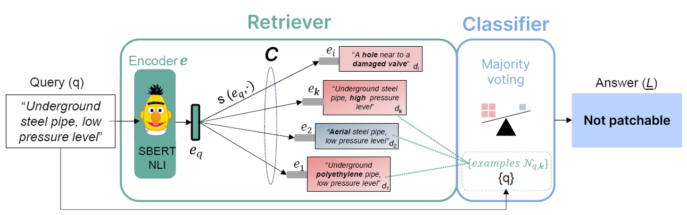

# CoRe-S: Classifying Gas Pipe Damage Descriptions in Low-Diversity Corpora

[](https://www.python.org/downloads/)
[](LICENSE)

This repository contains the implementation of a novel retrieval-based text classification framework designed for gas pipe damage description analysis. The work focuses on determining patch applicability in low-diversity corpora with domain-specific terminology.

<!-- ## 📄 Paper

**"Classifying Gas Pipe Damage Descriptions in Low-Diversity Corpora"**  
*Luca Catalano, Federico D'Asaro, Michele Pantaleo, Minal Jamshed, Prima Acharjee, Nicola Giulietti, Eugenio Fossat, Giuseppe Rizzo*

Published at CLiC-it 2025: Eleventh Italian Conference on Computational Linguistics -->

## 🔍 Overview

Traditional text classification methods often struggle with specialized domains that exhibit:
- **Low lexical diversity** - repetitive vocabulary and domain-specific terminology
- **Class imbalance** - skewed distribution of target classes
- **Subtle semantic differences** - fine-grained distinctions critical for classification

Our framework addresses these challenges using a training-free, retrieval-based approach that leverages Natural Language Inference (NLI) pre-trained encoders.

## 🏗️ Architecture
<!-- add image -->


The system works by:
1. **Encoding** queries and corpus documents using SBERT-NLI
2. **Retrieving** the most similar labeled examples using L2 distance
3. **Classifying** through majority voting on top-k retrieved instances

## 📊 Key Contributions

### 1. CoRe-S Dataset
- **11,904** synthetic gas pipe damage descriptions
- Binary classification: Patchable (1.06%) vs Unpatchable (98.47%)
- Generated from 15 structured features using Mistral-7B

### 2. Corpus Pairwise Diversity Metric
A novel metric to quantify lexical diversity in text corpora:

$$D_J(D) = \frac{1}{\binom{N}{2}} \sum_{1 \leq i < j \leq N} \delta_J(d_i, d_j)$$

| Dataset | Documents | Vocabulary | Diversity Score |
|---------|-----------|------------|-----------------|
| 20NewsGroups | 10,998 | 85,551 | **0.99** |
| Yahoo! Answers | 1,375,428 | 739,655 | **0.99** |
| **CoRe-S** | 11,903 | 2,283 | **0.69** |

### 3. Training-Free Classification
Demonstrates that NLI-pretrained encoders excel in low-diversity settings by capturing subtle semantic differences.

## 📈 Results

### Main Performance Comparison

| Method | Precision (macro) | Recall (macro) | **F1 (macro)** |
|--------|------------------|----------------|----------------|
| Baseline-mean | 0.517 | 0.506 | 0.508 |
| 0SHOT-NLI | 0.497 | 0.500 | 0.497 |
| LLM – 0SHOT | 0.514 | 0.736 | 0.466 |
| LLM – FEWSHOT | 0.517 | 0.756 | 0.501 |
| **OURS** | 0.704 | 0.672 | **0.687** |

**🎯 35.2% improvement** in macro F1-score over the second-best method!

### Encoder Performance Analysis

Performance varies significantly based on corpus diversity:

| Dataset | SBERT-NLI | MPNet | QA-MPNet |
|---------|-----------|-------|----------|
| **CoRe-S** (low diversity) | **0.609** | 0.521 | 0.503 |
| 20NewsGroups (high diversity) | 0.555 | **0.752** | 0.744 |
| Yahoo Answers (high diversity) | 0.505 | **0.638** | 0.618 |

## 🚀 Getting Started

### Prerequisites

- Python 3.8+
- CUDA-compatible GPU (recommended)
- Required packages listed in `requirements.txt`

### Installation

```bash
git clone https://github.com/links-ads/core-unimodal-retrieval-for-classification.git
cd core-unimodal-retrieval-for-classification
pip install -r requirements.txt
```

### Repository Structure

```
core-unimodal-retrieval-for-classification/
├── main/
│   └── core-synthetic_main.py          # Main execution script
├── configs/
│   ├── core-synthetic_config.yaml      # Configuration file
│   ├── 20newsgroups_config.yaml        # Configuration file
│   ├── sms_spam_config.yaml            # Configuration file
├── data/                               # Dataset directory (create this)
│   ├── 20newsgroups/
│   ├── sms_spam/
│   └── core_synthetic/
├── checkpoints/                        # Model checkpoints (create this)
│   └── model_name.ckpt
├── src/
│   ├── modules/
│   |   └── retriever
│   |   └── reranker
│   |   └── decoder
│   ├── evaluations/
│   ├── datasets/
│   └── config.py 
│   └── logging.py
│   └── parser.py 
└── README.md
```

### Setup Data Directory

Create the required directories and download datasets:

```bash
# Create data directory
mkdir -p data

# Download and extract datasets
# For 20NewsGroups
wget -P data/ http://qwone.com/~jason/20Newsgroups/20news-bydate.tar.gz
tar -xzf data/20news-bydate.tar.gz -C data/

# For SMS Spam Dataset
wget -P data/ https://archive.ics.uci.edu/ml/machine-learning-databases/00228/smsspamcollection.zip
unzip data/smsspamcollection.zip -d data/sms_spam/

```

## 🏃‍♂️ Running the Code

### Basic Usage

```bash
python3 main/core-synthetic_main.py -c configs/core-synthetic_config.yaml
```

## 🔬 Key Findings

1. **NLI-pretrained encoders** (SBERT-NLI) excel in low-diversity settings by capturing logical relationships rather than surface-level similarity
2. **Random undersampling** is the most effective strategy for handling class imbalance in specialized domains
3. **Corpus diversity** is a critical factor in encoder selection for text classification tasks

<!-- ## 📚 Citation

If you use this work in your research, please cite:

```bibtex
@inproceedings{catalano2025classifying,
  title={Classifying Gas Pipe Damage Descriptions in Low-Diversity Corpora},
  author={Catalano, Luca and D'Asaro, Federico and Pantaleo, Michele and Jamshed, Minal and Acharjee, Prima and Giulietti, Nicola and Fossat, Eugenio and Rizzo, Giuseppe},
  booktitle={Proceedings of the Eleventh Italian Conference on Computational Linguistics (CLiC-it 2025)},
  year={2025},
  address={Cagliari, Italy}
}
``` -->

## 📄 License

This project is licensed under the MIT License - see the [LICENSE](LICENSE) file for details.

---

⭐ **Star this repository** if you find it useful for your research!